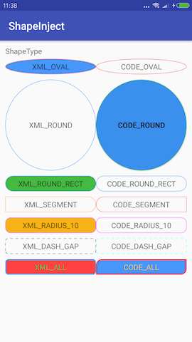

# ShapeInject

使用ShapeInject，可能很方便给View和ViewGroup设置背景，不用再写selector文件啦

# Preview

  

# Usage

XML方式：

```xml
<com.shape.ShapeTextView
    android:id="@+id/tv_all_xml"
    android:layout_width="0dp"
    android:layout_height="wrap_content"
    android:layout_marginTop="10dp"
    android:clickable="true"
    android:gravity="center"
    android:padding="5dp"
    android:text="XML_ALL"
    app:layout_constraintHorizontal_weight="1"
    app:layout_constraintLeft_toLeftOf="parent"
    app:layout_constraintRight_toLeftOf="@id/ll_all_code"
    app:layout_constraintTop_toBottomOf="@id/tv_dash_gap_code"
    app:normalBackgroundColor="#ff4141"
    app:normalStrokeColor="#4897fa"
    app:normalStrokeWidth="2dp"
    app:normalTextColor="#34c749"
    app:pressedBackgroundColor="#4897fa"
    app:pressedStrokeColor="#ff4141"
    app:pressedTextColor="#fdbc40"
    app:shapeRadius="5dp" />
```

代码方式：

```kotlin
val btnRoundCode: Button = findViewById(R.id.tv_round_code)
val roundColor = getColor("#46b942")
val pressBgColor = getColor("#994897fa")
val disableBgColor = getColor("#cc999999")
val normalBgColor = getColor("#3b8fed")
ShapeInject.inject(btnRoundCode).setShapeType(ShapeInject.TYPE_ROUND).setStroke(2, roundColor).setBackgroundColor(pressBgColor, disableBgColor, normalBgColor).background()
```

更多操作可以参考DEMO

# Download

使用`Gradle`进行引用

1.在你根目录的`build.gradle`文件添加代码: `maven { url 'https://www.jitpack.io' }`

```groovy
allprojects {
    repositories {
        ...
        maven { url 'https://www.jitpack.io' }
    }
}
```

2.在你的工程目录添加

`ShapeInject`依赖`appcompat-v7`，所以需要同时引用`appcompat-v7`包

```groovy
dependencies {
	implementation 'com.github.yzbzz:StylePhrase:1.0.3'
    implementation 'com.android.support:appcompat-v7:$version'
}
```

你也可以直接下载`StylePhrase`类放到你的工程中